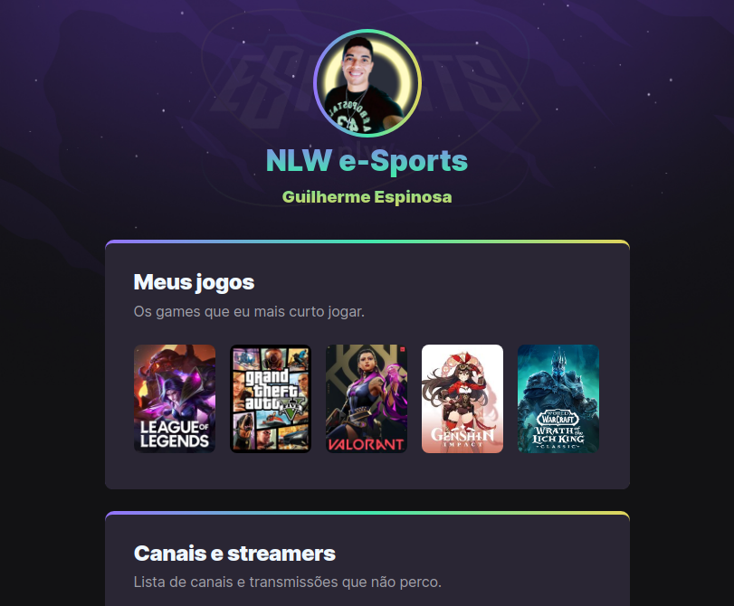

# NLW e-Sports
### Trilha Explorer - Rocketseat

---

[Veja na íntegra!](https://guilherme-espinosa.github.io/NLW/ "Projeto NLW")

###### Status: Trabalho concluído
###### Responsável: Guilherme Espinosa
###### Orientador: Maik Brito - Rocketseat
###### Plataforma de ensino: Rocketseat - Trilha Explorer.
---
 Projeto construído através do evento ***Next Level Week*** da ***Rocketseat***.

---
## Tecnologias utilizadas

- HTML
- Figma
- CSS
- Git
- Github

---

## Comentários pessoais

Este foi um projetinho super gostoso de se fazer. Apesar de ter sido bem suave, foi uma experiência bem única agradável, pois devo admitir que o orientador deste projeto, Maik Brito, foi muito didático e fez com que coisas que eu já tivesse visto ou feito antes agora fossem melhor compreendidas, além de muita coisa legal aprendida corretamente (como as animações de movimento).

Aproveitei pra fazer alguns ajustes leves em relação ao projeto original.

As principais alterações foram:
		
1. Divisão do CSS em arquivos de "reset" (formatação), "style" (estilo), "animations" (animações);
2. Uma leve alteração no tempo de execução e de delay das animações;
3. Adição da tag "hgroup" no HTML para colocar um título e nome do gamer/streamer que apresenta seus jogos e canais preferidos;
4. Adição de animação ao "hgroup" com tempo de delay um pouco maior que o da imagem anterior a ele;
5. Adição da ferramenta "webkit", pra deixar o "hgroup" com uma cor em degradê.
6. Adição de comentários dentro do arquivo CSS, mas apenas na parte de aplicação do webkit.

---

## Gostaria de entrar em contato comigo? Acesse o link abaixo.

[Visite meu LinkedIn.](https://guilherme-espinosa.github.io/NLW/ "Perfil do LinkedIn")